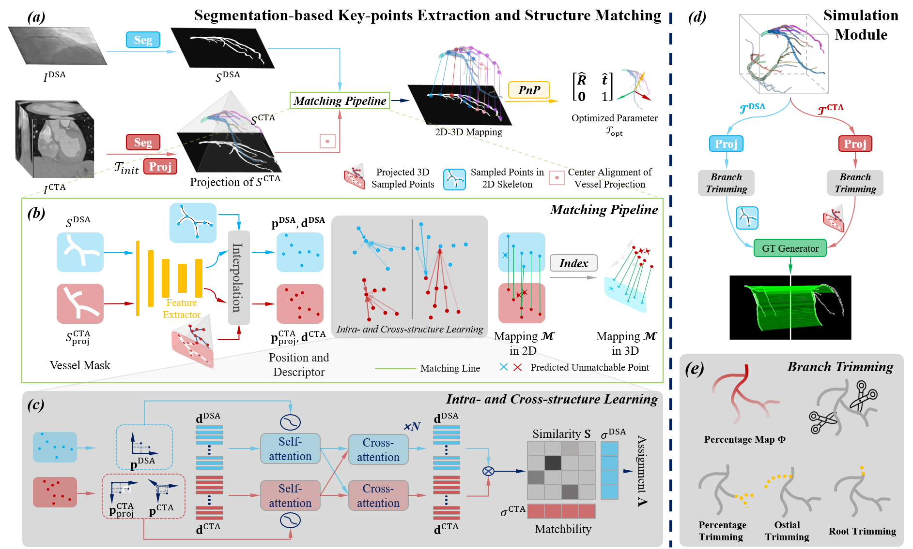

# Vascular-topology-aware Deep Structure Matching for 2D DSA and 3D CTA Rigid Registration
This repository implements a deep learning-based method for rigid DSA-CTA registration in cardiac navigation. The approach integrates a vascular-topology-aware framework with transformer-based techniques to improve vascular registration.
## Vascular-topology-aware Deep Structure Matching Framework
 
### Key Features:
- **Vascular Structure Matching**: Novel framework for 2D DSA and 3D CTA rigid registration, addressing vessel overlap and missing branches.
- **Realistic Data Generation**: Simulation strategy to generate datasets that replicate real-world challenges, such as branch missing and vessel overlap.
- **Comprehensive Datasets**: Utilizes both large clinical and simulated datasets for training and evaluation.

The method demonstrates effectiveness and robustness on both simulated and real-world datasets.


## Inference
### Simulated Dataset
For inference on simulated datasets, we provide an example script that demonstrates how to use the trained model. The script can be found in the `glue-factory\pipeline_simulating_func.py` file.
To run the inference on simulated datasets, simply execute the following command:
```bash
python glue-factory/pipeline_simulating_func.py \
    --config_path config/glue-factory/config_simulating.yaml \
    --checkpoint_path path/to/your/checkpoint.pth \
    --output_dir path/to/output/directory
```
### Real-world Dataset
To run inference on real-world datasets, we provide an example script that demonstrates how to use the trained model. The script can be found in the `glue-factory\pipeline_real_func.py` file.
To run the inference on real-world datasets, simply execute the following command:
```bash
python glue-factory/pipeline_real_func.py \
    --config_path config/glue-factory/config_real.yaml \
    --checkpoint_path path/to/your/checkpoint.pth \
    --output_dir path/to/output/directory \
    --save_path path/to/save/results
```

## Data
### Simulated Dataset
Coming soon! We will provide a simulated dataset that replicates the challenges of real-world DSA-CTA registration, including vessel overlap and missing branches.
### Real-world Dataset
Coming soon!

## Simulation Module
The simulation module is designed to generate synthetic datasets that mimic the challenges of real-world DSA-CTA registration. It includes functions for simulating vessel overlap and missing branches, which are crucial for training robust models.
The module can be found in class `VesselTree` of the file `glue-factory\gluefactory\utils\vessel_tool.py`. Class `VesselDataset` in `\glue-factory\gluefactory\datasets\vessel_centerline_point_online_cut_sample.py` use this module to generate synthetic datasets.
### visualizing the simulated process
You can visualize the simulated process by running the following command:
```bash
python glue-factory/check_random_cut.py
```
You need to modify the `config_path` in the `glue-factory/check_random_cut.py` file to your own path.
## Training
Coming soon! 

## Non-rigid Registration
We are currently working on extending our framework to support non-rigid registration. This will involve developing a non-rigid simulation module, training code, and inference scripts. Stay tuned for updates!

## TODO List
### 1. Inference  
- [x] Open-source inference model weights  
- [x] Release example inference script on simulated datasets
- [x] Release example inference script on real-world datasets
### 2. Data  
- [ ] Open-source partial simulation data  
- [ ] Open-source partial real-world data (considering data privacy)  
### 3. Simulation Module  
- [x] Organize and release simulation code  
- [x] Provide example simulation data  
- [ ] Write usage documentation for the simulation module  
### 4. Training  
- [x] Open-source training code  

### 5. Non-rigid Registration  
- [ ] Non-rigid simulation module
- [ ] Non-rigid training code
- [ ] Non-rigid inference script

> **News**: Our paper **"Vascular-topology-aware Deep Structure Matching for 2D DSA and 3D CTA Rigid Registration"** has been accepted to the **2025 International Conference on Information Processing in Medical Imaging (IPMI)**! 


## Citation

If you find this work helpful, please consider giving this repository a star ⭐ and citing our paper:
```
@INPROCEEDINGS{Xiong2025IPMI,
  author       = {Xiong, Xiaosong and Jiang, Caiwen and Wu, Peng and Zhang, Xiao and Song, Yanli and Zhang, Xinyi and Tao, Ze and Wu, Dijia and Shen, Dinggang},
  author+an    = {1=highlight},
  title        = {Vascular-topology-aware Deep Structure Matching for 2D DSA and 3D CTA Rigid Registration},
  booktitle    = {Information Processing in Medical Imaging (IPMI)},
  year         = {2025},
  note         = {To appear}
}
```

### Acknowledgment
This work was conducted at **United Imaging Intelligence (联影智能)** and **ShanghaiTech University (上海科技大学)**.  
We sincerely appreciate their support.

<p align="center">
  
  
</p>

This project is partially built upon the [**Glue Factory**](https://github.com/cvg/glue-factory) framework developed by the Computer Vision Group (CVG). 


## License & Commercial Use

This repository is released for academic and research purposes only.  
All code and data are the property of United Imaging Intelligence (联影智能).  
Commercial use is **strictly prohibited** without prior written permission.

For commercial licensing or partnership inquiries, please contact: yanli.song@uii-ai.com
